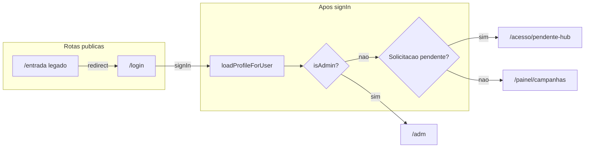

# Acessos, autenticação e governança HUB

Referência para **desenvolvedores e PO**: rotas, guards, identidade pós-login e dados Supabase usados pelo frontend (`frontend/`). Complementa [MKDS.md](./MKDS.md) (UI) e [PLANEJAMENTO.md](./PLANEJAMENTO.md) (fases do produto). Para o **mapa comercial dos CRMs**, regra «CRM = venda» e direcção de **templates por organização** e permissões, ver [CRM_MAPA_COMERCIAL_CONTROLE_ORG.md](./CRM_MAPA_COMERCIAL_CONTROLE_ORG.md).

---

## 1. Stack e ficheiros centrais

| Ficheiro | Papel |
|----------|--------|
| [frontend/src/App.jsx](../frontend/src/App.jsx) | Declaração de rotas, `Protected`, `AdminOnly`, `ParticipantHomeRedirect`, `ImoveisLegacyRedirect`. |
| [frontend/src/context/AuthContext.jsx](../frontend/src/context/AuthContext.jsx) | Sessão Supabase, `loadProfileForUser`, `isAdmin`, `hubSolicitacaoPendente`, `identityReady`, `signIn` / `signUp` / reset de senha. |
| [frontend/src/lib/postLoginPath.js](../frontend/src/lib/postLoginPath.js) | Função `getPostLoginPath` (destino após login). |
| [frontend/src/lib/hubOwner.js](../frontend/src/lib/hubOwner.js) | `isHubOwnerEmail` (UI da fila em `/adm`, alinhada a `VITE_HUB_OWNER_EMAIL`). |

---

## 2. Rotas públicas (sem obrigar sessão)

| Rota | Componente | Função |
|------|------------|--------|
| `/entrada` | `EntradaPage` | Compatibilidade: `?tpl=` → cadastro de organização; caso contrário redireciona para `/login`. |
| `/login` | `LoginPage` | Login único (e-mail/senha). Destino após entrar: [postLoginPath.js](../frontend/src/lib/postLoginPath.js) (admin HUB → `/adm/...`, pendente → `/acesso/pendente-hub`, participante → home do portal). |
| `/login/:portal` | `LoginPage` | Mesmo ecrã; `hub` ou `imoveis` grava o portal em `localStorage` (home de participante é a mesma URL em ambos, hoje). |
| `/login/recuperar-senha` | `ForgotPasswordPage` | Pedido de e-mail de recuperação (`resetPasswordForEmail`). |
| `/login/redefinir` | `ResetPasswordPage` | Nova senha após redirect do Supabase (`updatePassword`). |
| `/acesso/governanca-hub` | — | `Navigate` para `/login` (URL legada). |
| `/acesso/governance-hub` | — | `Navigate` para `/login` (alias EN). |

Layout: [AuthSplitLayout](../frontend/src/components/AuthSplitLayout.jsx) (split hero + formulário; em desktop a coluna do formulário é a zona com scroll).

---

## 3. Rotas protegidas

| Rota | Guard | Descrição |
|------|--------|-----------|
| `/` | `Protected` | Redirect para `getParticipantHomePath(portal)` (hoje: `/painel/campanhas` — painel de insights). |
| `/imoveis` | `Protected` | Redirect para a mesma home (`getParticipantHomePath`). |
| `/crm` | `Protected` | CRM Geral (`CrmHomePage`). |
| `/crm/:segment` | `Protected` | Placeholders por segmento. |
| `/painel/campanhas` | `Protected` | Painel de campanhas / insights. |
| `/acesso/pendente-hub` | `Protected` | Utilizador com solicitação **pendente** ainda **sem** papel admin. |
| `/adm` | `AdminOnly` (`isAdmin`) | Auditoria + fila de aprovação (`AdminAuditPage`; visão **owner** filtrada por `VITE_HUB_OWNER_EMAIL` no cliente). |
| `/adm/configuracoes`, `/adm/templates`, `/adm/usuarios` | `AdminOnly` | Placeholders de governança. |

`Protected`: sem sessão → `/login`; pendência de governança (não admin) → `/acesso/pendente-hub`.  
`AdminOnly`: sem sessão → `/login`; sem `isAdmin` → `getParticipantHomePath(portal)` (ou pendência → `/acesso/pendente-hub`).

---

## 4. Decisão de destino após login

Implementação: `getPostLoginPath({ isHubAdmin, hubSolicitacaoPendente, portal })` em [postLoginPath.js](../frontend/src/lib/postLoginPath.js).

Ordem:

1. **`/adm`** — se `isHubAdmin === true`.
2. **`/acesso/pendente-hub`** — se **não** é admin **e** existe linha em `hub_solicitacoes_admin` com `status = 'pendente'` para o `user_id` atual.
3. **Home do ambiente** — `getParticipantHomePath(portal)` (hoje **`/painel/campanhas`** para Hub e Imóveis).

`AuthContext` agrega `isAdmin` a partir de:

- `hub_admins` (ativo),
- `perfis.administrador_hub`,
- legado: `profiles.role === 'admin'` ou `can_access_audit`.

`hubSolicitacaoPendente` só é considerado quando o utilizador **ainda não** entra como admin (evita bloquear quem já foi promovido).

`identityReady` fica `false` até `loadProfileForUser` concluir, para não redirecionar antes de conhecer papel e fila.

---

## 5. Tabelas e RLS (Supabase)

| Tabela | Uso no fluxo |
|--------|----------------|
| `auth.users` | Conta Supabase Auth. |
| `profiles` | Legado; `role`, `can_access_audit`, `full_name`. |
| `perfis` | Perfil operacional; `administrador_hub`, `nome_exibicao`, etc. |
| `hub_admins` | Administrador HUB ativo → acesso `/adm` quando `ativo` e políticas alinhadas. |
| `hub_solicitacoes_admin` | Pedidos de perfil administrativo; insert público (pendente); leitura/atualização via políticas de admin HUB. |

Scripts de referência em `database/`, por exemplo [hub_solicitacoes_admin.sql](../database/hub_solicitacoes_admin.sql) e políticas relacionadas em [rls_hub_admin_governanca_total.sql](../database/rls_hub_admin_governanca_total.sql).

**Nota de produto:** aprovar na UI deve manter-se **coerente** com promoção em `hub_admins` e atualização de `hub_solicitacoes_admin` (evitar estados ambíguos).

---

## 6. Variáveis de ambiente (frontend)

| Variável | Uso |
|----------|-----|
| Credenciais Supabase (`VITE_SUPABASE_URL`, `VITE_SUPABASE_ANON_KEY`) | Cliente público; obrigatórias para fluxo auth completo. |
| `VITE_HUB_OWNER_EMAIL` | Filtra na UI da fila em `/adm` (e-mail do owner da plataforma); não substitui RLS no servidor. |

Ver também [frontend/.env.example](../frontend/.env.example).

### Supabase Auth (projeto)

- **Confirm email:** se ativo, o utilizador pode precisar confirmar o e-mail antes de sessão completa; alinhar mensagens em cadastro governança.
- **Redirect URLs:** incluir origem do front e caminhos de redefinição (ex.: `/login/redefinir`).

---

## 7. Modo sem Supabase configurado

Se `isSupabaseConfigured()` for falso, `App.jsx` pode renderizar apenas o painel de campanhas **sem** router de login/HUB — útil para demo local de UI; não reflete o produto com auth.

---

## 8. Diagrama (alto nível)

---

## 9. Documentos relacionados

- [MKDS.md](./MKDS.md) — tokens, `AuthSplitLayout`, `HubBrandMark`, páginas de auth.
- [UI_LOGIN_E_IDENTIDADE.md](./UI_LOGIN_E_IDENTIDADE.md) — diretriz de produto (paleta alternativa); implementação efetiva no MKDS.
- [PLANEJAMENTO.md](./PLANEJAMENTO.md) — marcos e próximos passos do MVP de auth/governança.
