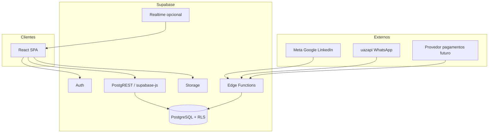

# Arquitetura técnica — Obra10+ HUB (v0)

Visão de **alto nível** para alinhar engenharia: camadas, responsabilidades, fluxos de dados e segurança. Stack: **React**, **Supabase** (Postgres, Auth, RLS, Storage, Realtime opcional), **Edge Functions** pontuais. Detalhe de colunas em [SCHEMA_DADOS_V0.md](./SCHEMA_DADOS_V0.md).

---

## 1. Princípios arquiteturais

| Princípio | Implicação |
|-----------|------------|
| Uma plataforma, módulos no mesmo núcleo | Mesmo projeto front + mesmo banco; evitar microserviços prematuros |
| Multi-tenant por organização | `organizacao_id` + RLS em dados sensíveis |
| Centro lógico: negócio | Serviços e telas orbitam `negocio_id` onde aplicável |
| Orientado a eventos | Fatos append-only em `domain_events` (e automações futuras) |
| Segredos fora do browser | Webhooks, PSP, tokens WhatsApp só em Edge Function ou ambiente servidor |

---

## 2. Diagrama lógico (camadas)

---

## 3. Fluxos principais

### 3.1 Usuário interno (CRM)

1. Login via **Supabase Auth**.
2. React obtém sessão; queries usam **anon key** + JWT (usuário).
3. **PostgREST** aplica **RLS**: apenas linhas da(s) organização(ões) do usuário.
4. Mutações (insert/update) idem; triggers opcionais gravam `domain_events`.

### 3.2 Webhook de captação (ads / WhatsApp)

1. Provedor externo chama **HTTPS** da Edge Function (URL pública).
2. Function valida corpo/assinatura (conforme provedor), normaliza payload, resolve `organizacao_id` (header, path ou mapeamento instância → org).
3. **Insert** com idempotência (ex.: chave `wa_chatid` + `organization_id` ou `idempotency_key`).
4. Opcional: enqueue futuro (fila) — não obrigatório na v0.

### 3.3 Arquivos (contratos, anexos)

1. Upload direto do cliente para **Storage** com policy que restringe pasta/prefixo à organização **ou** upload via Function com validação.
2. Metadados do arquivo em tabela Postgres (`contratos`, `anexos`) com `storage_path`.

### 3.4 Financeiro — escrow / contas no provedor (BaaS / PSP)

Quando o produto evoluir além de estados “só no banco”:

1. Gatilho: evento de domínio **`CONTRATO_ASSINADO`** (ou webhook do **DocuSign / Clicksign / etc.**) consumido por **Edge Function** ou job.
2. Function autentica na **API do PSP/BaaS** (chave só no servidor), cria **conta virtual / subconta / escrow lógico** vinculada ao `negocio_id`, com **idempotency key** (ex.: `negocio_id` + versão de contrato) para não duplicar conta em retry.
3. Grava em Postgres: `provider`, ids externos, status; opcional tabela `escrow_contas` ou colunas em `pagamentos` / `negocios`.
4. **Webhooks** do provedor (pagamento recebido, liberação, chargeback) → validação de assinatura → **update** idempotente no Postgres → `domain_events`.

O **Supabase** continua sendo a **fonte da verdade operacional**; o provedor é **custódia/execução** de valores conforme contrato comercial e regulatório.

---

## 4. Bounded contexts (visão modular)

Não são serviços separados no início; são **pacotes lógicos** no front e **tabelas** no banco:

| Contexto | Responsabilidade |
|----------|------------------|
| **Identidade / org** | `organizacoes`, `organizacao_membros`, papéis |
| **CRM / negócio** | `negocios`, `pipeline_estagios`, `pessoas`, `empresas`, oportunidades |
| **Imobiliário** | `imoveis`, vínculos a negócio |
| **Operação** | `projetos`, `obras` (nomes podem variar no schema) |
| **Contratos** | `contratos`, Storage |
| **Financeiro** | `pagamentos`, regras de estado; **PSP/BaaS via Edge** para escrow/split quando adotado |
| **Integrações** | Edge Functions, tabelas de config (`channel_instances`, etc.) |
| **Auditoria / inteligência** | `domain_events`, leituras agregadas (views ou replica futura) |

---

## 5. Segurança

| Tema | Abordagem |
|------|-----------|
| Autenticação | Supabase Auth (JWT) |
| Autorização | **RLS** no Postgres; papéis em `organizacao_membros.papel` |
| API keys | `service_role` apenas em Edge Functions / CI, nunca no bundle React |
| Webhooks | Validar origem/payload; rate limit na borda (Supabase / provedor) |

---

## 6. Ambientes e deploy

- **Desenvolvimento:** projeto Supabase local ou cloud dev; `.env.local` no React.
- **Staging:** espelho de migrations; testes de RLS obrigatórios antes de produção.
- **Produção:** migrations apenas forward; backup e PITR conforme plano Supabase.

---

## 7. Evolução prevista (sem implementar agora)

- Read replica ou warehouse para BI pesado.
- Fila (pgmq, Supabase Queues, ou externa) para processamento assíncrono.
- Mobile ou PWA se o campo exigir.

---

## Documentos relacionados

- [FLUXO_INICIO_DESENVOLVIMENTO.md](./FLUXO_INICIO_DESENVOLVIMENTO.md)
- [SCHEMA_DADOS_V0.md](./SCHEMA_DADOS_V0.md)
- [SPEC.md](./SPEC.md)
- [GUIA_CAPTACAO_WHATSAPP_UAZAPI.md](./GUIA_CAPTACAO_WHATSAPP_UAZAPI.md)
- [EVENTOS_SERVICO_E_FINTECH.md](./EVENTOS_SERVICO_E_FINTECH.md)

---

*Versão v0 — atualizar quando a primeira migration estiver no repositório.*
