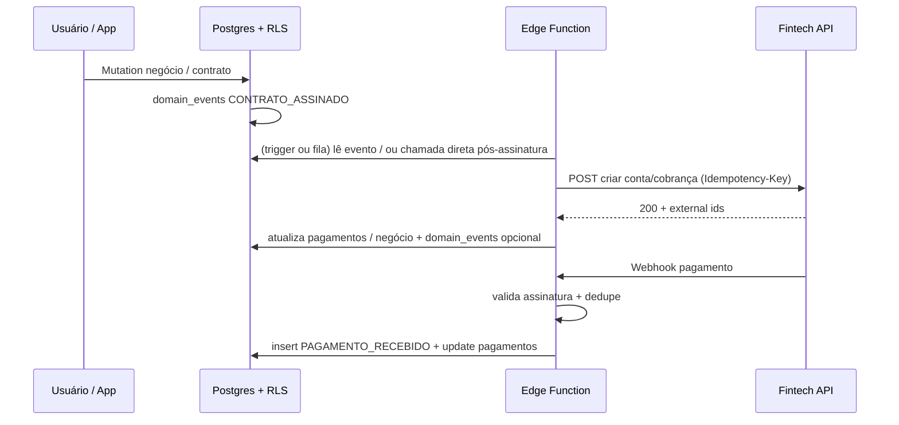

# Serviço de eventos de domínio + integração fintech — Obra10+ HUB

Define **como** o Obra10+ cumpre o PRD: cada fato relevante **registrado**, com **responsável**, **data/hora**, **histórico**, base para **relatórios** e gatilho para **automações** e para **fintech** (PSP/BaaS).

Documentos relacionados: [SPEC.md §7](./SPEC.md), [SCHEMA_DADOS_V0.md §2.7](./SCHEMA_DADOS_V0.md), [ARQUITETURA.md §3.4](./ARQUITETURA.md), [SPEC.md §5.9](./SPEC.md) (escrow via API).

### Leitura rápida — decisão de produto

O **“serviço” de eventos não precisa ser um microserviço no dia 1**: é **contrato + disciplina** — tudo que importa vira **linha em `domain_events`**, e a **fintech entra só por Edge Function** (segredo no servidor + **idempotência** em chamadas e webhooks).

A **escolha do provedor** (qual fintech / PSP / BaaS) fica para **ADR** depois de **jurídico e compliance**; o **modelo de eventos permanece agnóstico ao vendor** (tipos estáveis, `payload` e IDs externos no JSON).

---

## 1. Papel do serviço de eventos

| Objetivo | Como |
|----------|------|
| **Histórico** | Timeline por `negocio_id` = consulta ordenada a `domain_events` (+ joins leves) |
| **Auditoria** | Quem fez (`ator_user_id`) + quando (`ocorrido_em` / `criado_em`) + contexto (`payload`) |
| **Relatórios** | Agregações SQL por `tipo`, `organizacao_id`, intervalo, origem no payload |
| **Automações** | Consumidor assíncrono lê novos eventos ou recebe push (Fase 2/3) |
| **Fintech** | Eventos **saem** (gatilho para API) e **entram** (webhook → novo `domain_events`) |

Em resumo: ver **Leitura rápida — decisão de produto** (acima).

---

## 2. Requisitos do PRD × implementação

| Requisito | Implementação |
|-----------|----------------|
| Ficar registrado | Linha **append-only** em `domain_events` (sem DELETE em rotina) |
| Ter responsável | `ator_user_id` (uuid → `auth.users`) ou `null` + `payload.ator_sistema` para jobs/webhooks |
| Ter data e hora | `criado_em` (gravação) e, quando aplicável, `ocorrido_em` (fato no mundo real) |
| Gerar histórico | UI “linha do tempo” = query por `negocio_id` |
| Alimentar relatórios | Views/materialized views agregando por `tipo` e dimensões no `payload` |
| Disparar automações | **Fase 1:** manual/polling; **Fase 2+:** Database Webhook, fila, ou Edge agendada consumindo eventos ou tabela `outbox` |

---

## 3. Cadeia canônica (PRD) — tipos e ordem lógica

Ordem típica; nem todo negócio passa por todos os passos.

| Ordem | Tipo `domain_events.tipo` | Significado | `negocio_id` |
|-------|---------------------------|-------------|--------------|
| 1 | `LEAD_CRIADO` | Entrada CRM (pode existir antes de linha formal em `negocios`, conforme modelagem) | opcional |
| 1b | *(implícito ou explícito)* | Promoção **Lead ⇒ Negócio**: criação/atualização em `negocios` + evento `NEGOCIO_CRIADO` ou primeiro estágio | obrigatório após criar |
| 2 | `LEAD_QUALIFICADO` | Qualificação comercial | obrigatório |
| 3 | `PROPOSTA_ENVIADA` | Proposta ao cliente | obrigatório |
| — | `NEGOCIO_FECHADO` | Fechamento comercial | obrigatório |
| 4 | `CONTRATO_ASSINADO` | Contrato vinculado ao negócio efetivamente assinado | obrigatório |
| 5 | `PROJETO_INICIADO` | Projeto de arquitetura no negócio | obrigatório se houver |
| 6 | `SERVICO_INICIADO` | Serviço (obra, marcenaria, etc.) iniciado | obrigatório se houver |
| 7 | `ETAPA_CONCLUIDA` | Marco/entrega (payload: `etapa_id`, nome) | obrigatório |
| 8 | `PAGAMENTO_RECEBIDO` | Valor capturado (fintech confirma ou registro manual auditado) | obrigatório |
| 8b | `PAGAMENTO_EM_ESCROW` | Opcional: valor retido no provedor (ou usar só `payload` em `PAGAMENTO_RECEBIDO`) | obrigatório |
| 9 | `PAGAMENTO_LIBERADO` | Liberação após regras (split, escrow) | obrigatório |

**Outros tipos** já previstos no SPEC: `IMOVEL_CADASTRADO`, `OPORTUNIDADE_CRIADA`, `RELATORIO_ENVIADO`, `FORNECEDOR_VINCULADO`, `ADITIVO_APROVADO`, `MENSAGEM_RECEBIDA_WHATSAPP`, etc.

### 3.1 Payload mínimo sugerido (JSON)

Contrato flexível; exemplos:

```json
// LEAD_QUALIFICADO
{ "motivo": "texto ou codigo", "estagio_anterior_id": "uuid", "estagio_novo_id": "uuid" }

// CONTRATO_ASSINADO
{ "contrato_id": "uuid", "provedor_assinatura": "clicksign", "external_envelope_id": "..." }

// PAGAMENTO_RECEBIDO
{ "pagamento_id": "uuid", "valor": "1234.56", "moeda": "BRL", "provedor_fintech": "psp_x", "external_payment_id": "..." }

// PAGAMENTO_LIBERADO
{ "pagamento_id": "uuid", "regra": "etapa_obra_ok", "provedor_fintech": "psp_x", "external_payout_id": "..." }
```

---

## 4. Modelo de dados (`domain_events`)

Base: [SCHEMA_DADOS_V0.md §2.7](./SCHEMA_DADOS_V0.md). Evolução recomendada (mesma tabela):

| Coluna | Função |
|--------|--------|
| `ocorrido_em` | Instant do fato (assinatura, confirmação Pix); default = `criado_em` |
| `fonte` | `app` \| `webhook_fintech` \| `webhook_assinatura` \| `edge_function` \| `sistema` |
| `idempotencia_chave` | Evita duplicar o mesmo webhook/retry (UNIQUE parcial com `organizacao_id`) |
| `correlacao_id` | Liga vários eventos de uma mesma transação (ex.: escrow + split) |

**RLS:** mesmo padrão das demais tabelas com `organizacao_id`; eventos financeiros sensíveis podem exigir policy extra por papel.

---

## 5. Quem grava o evento (produtores)

| Origem | Quem grava | Observação |
|--------|------------|------------|
| Ação do usuário no app | **React → Supabase** após mutation bem-sucedida **ou** **RPC Postgres** que faz insert negócio + evento na mesma transação | Preferir **RPC/transação** para não ficar negócio sem evento |
| Webhook assinatura | **Edge Function** valida assinatura HTTP, atualiza `contratos`, insere `CONTRATO_ASSINADO` | Segredo só no servidor |
| Webhook fintech | **Edge Function** valida, idempotência por `idempotencia_chave`, insere `PAGAMENTO_*` | Nunca confiar só no front |
| Job agendado | Edge/cron com `service_role` controlado | Registrar `ator_user_id` null + `fonte=sistema` |

**Regra:** eventos que **movem dinheiro** ou **assinatura** devem ser produzidos **no servidor** ou em transação atômica no banco.

---

## 6. Integração fintech (visão de serviço)

“Fintech” aqui = **PSP / BaaS / adquirente** com API e webhooks (ver [SPEC §5.9](./SPEC.md)).

### 6.1 Saída: evento Obra10+ → ação na fintech

| Evento interno | Ação típica na API | Responsável |
|----------------|-------------------|-------------|
| `CONTRATO_ASSINADO` | Criar **subconta / wallet / cobrança** vinculada ao `negocio_id` | Edge Function |
| `NEGOCIO_FECHADO` | (Opcional) Pré-configurar recebíveis conforme regra comercial | Edge / manual |
| Regra de liberação atendida | Chamar API de **split / payout** | Edge Function após validação + auditoria |

Fluxo: **DB insert** `domain_events` + **chamada HTTP** idempotente (`Idempotency-Key` = hash de `negocio_id` + tipo + versão contrato). Falha na API → retry com mesma chave; log de erro em `payload` ou tabela de falhas.

### 6.2 Entrada: webhook fintech → evento Obra10+

| Notificação do provedor | Evento gravado | Efeitos colaterais |
|-------------------------|----------------|-------------------|
| Pagamento confirmado | `PAGAMENTO_RECEBIDO` | Atualizar `pagamentos.status`, `provedor_pagamento_id` |
| Valor retido (escrow) | `PAGAMENTO_EM_ESCROW` ou payload no anterior | Estado retido |
| Liberação / split concluído | `PAGAMENTO_LIBERADO` | Atualizar partes, notificar UI |

**Idempotência:** usar `external_event_id` do provedor como `idempotencia_chave` (ou composto `organizacao_id + provider + event_id`).

### 6.3 Diagrama lógico



---

## 7. Histórico (UI) e relatórios

- **Timeline:** `SELECT * FROM domain_events WHERE negocio_id = $1 ORDER BY ocorrido_em DESC NULLS LAST, criado_em DESC`.
- **Relatórios:** `COUNT(*) FILTER (WHERE tipo = 'PROPOSTA_ENVIADA')` por org/semana; funis a partir de sequência de tipos; **join** com `negocios.origem` para performance por canal.
- **Exportação:** view `v_eventos_analytics` com colunas achatadas para BI (futuro).

---

## 8. Automações (evolução)

| Fase | Mecanismo |
|------|-----------|
| **1** | Sem fila: apenas gravação de eventos; automações manuais ou scripts |
| **2** | **Supabase Database Webhooks** em `domain_events` INSERT (filtrar tipos) → Edge; ou polling Edge agendado |
| **3** | Fila dedicada (pgmq / externa); workers idempotentes; regras declarativas (tabela `automacao_regras`) |

---

## 9. Governança e escolha da fintech

- Documentar provedor escolhido, ambientes (sandbox/prod), e mapeamento campo-a-campo em **ADR**.
- **Compliance:** KYC, contrato de encarteiramento, split, chargeback — fora do escopo técnico deste arquivo; o modelo de eventos permanece **agnóstico**.
- Manter **Supabase** como ledger operacional; fintech como **execução** de pagamento, sempre refletida em `pagamentos` + `domain_events`.

---

## 10. Checklist de implementação (engenharia)

1. Migration: colunas opcionais em `domain_events` (`ocorrido_em`, `fonte`, `idempotencia_chave`, `correlacao_id`) + índices.
2. Biblioteca ou RPC `registrar_evento(tipo, negocio_id, payload, ...)` com transação.
3. Edge Function `webhook-fintech` + `webhook-assinatura` com testes de idempotência.
4. Tela timeline no detalhe do negócio.
5. ADR com nome do PSP/BaaS e mapeamento dos webhooks.

---

*Documento normativo para o serviço de eventos e ponte com fintech; revisar após escolha do provedor.*
