# Fluxogramas — entidades Obra10+ HUB

Diagramas em [Mermaid](https://mermaid.js.org/) alinhados ao [SPEC.md](./SPEC.md), [MODULOS_PERMISSOES_E_HUB.md](./MODULOS_PERMISSOES_E_HUB.md) e [SCHEMA_DADOS_V0.md](./SCHEMA_DADOS_V0.md). O **Negócio** (`ID_NEGOCIO`) é o **aggregate root** comercial; demais entidades orbitam ou se vinculam a ele.

**Como visualizar:** preview Markdown no VS Code/Cursor com extensão Mermaid, ou [mermaid.live](https://mermaid.live).

---

## 1. Visão geral: Negócio no centro

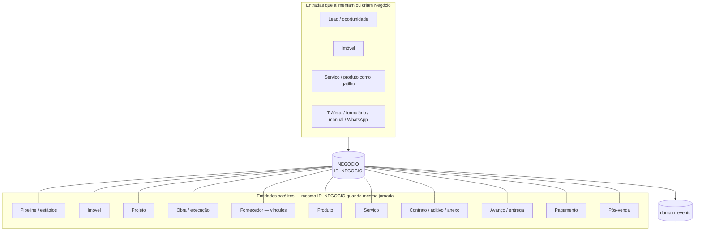

---

## 2. Modelo entidade–relação (core + multi-tenant)

Conceitual: uma **organização** (tenant) isola dados; **pessoa** e **empresa** são atores e partes no ecossistema.

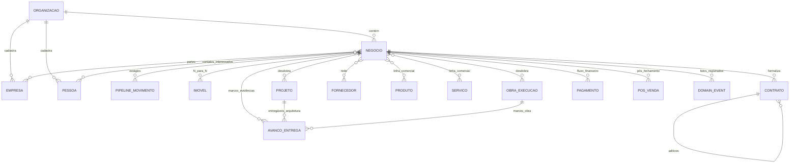

> **Nota:** `PIPELINE_MOVIMENTO` representa o negócio percorrendo estágios (equivalente conceitual a `pipeline` + histórico). Nomes físicos de tabelas podem diferir do schema v0.

---

## 3. Fluxo: de cadastro à consolidação (entidades em movimento)

Espelha o fluxo principal do SPEC (entradas → CRM → desdobramento → contratos → acompanhamento → financeiro → dados).

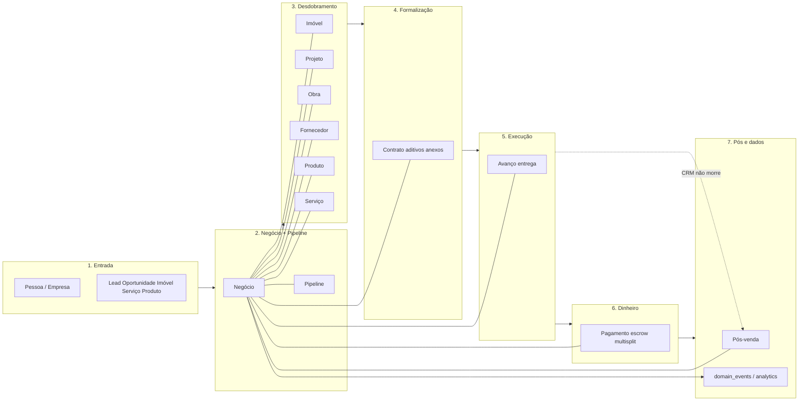

---

## 4. Fluxo por entidade (ciclo de vida resumido)

### 4.1 Pessoa

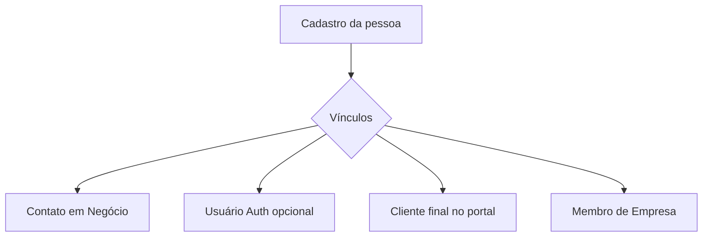

### 4.2 Empresa

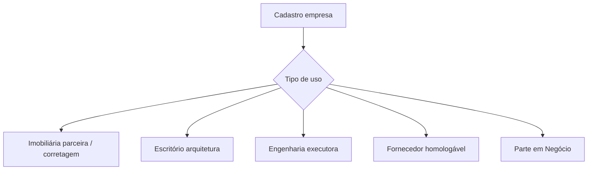

### 4.3 Negócio

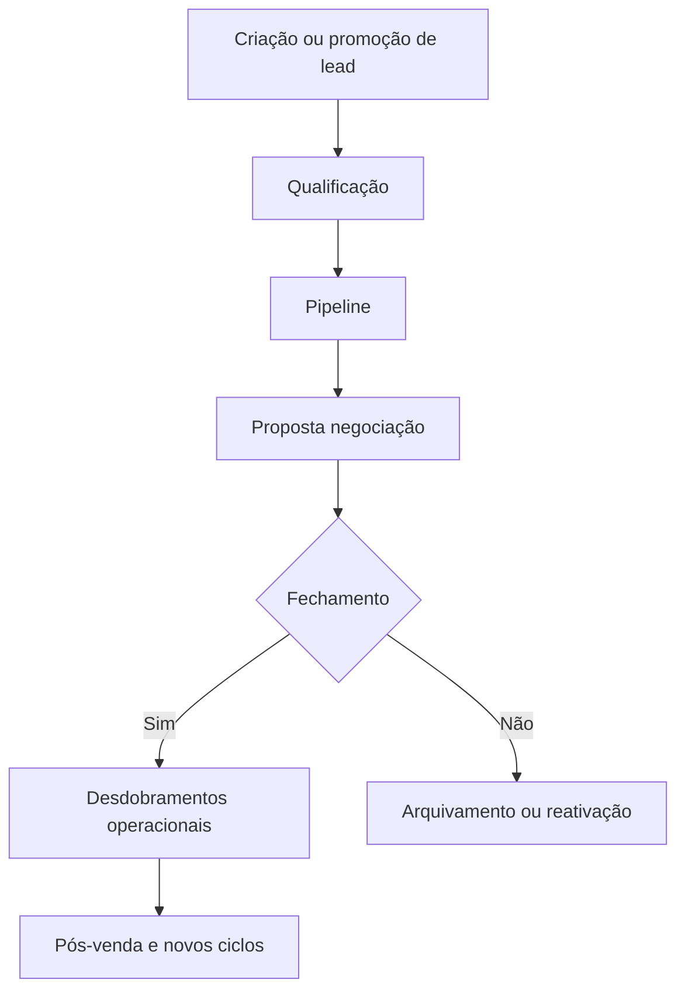

### 4.4 Pipeline

### 4.5 Imóvel

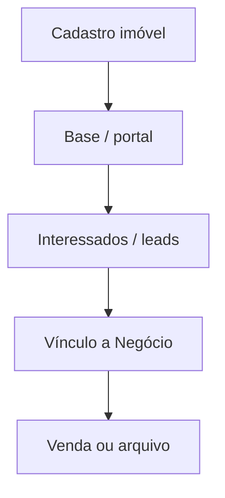

### 4.6 Projeto (arquitetura)

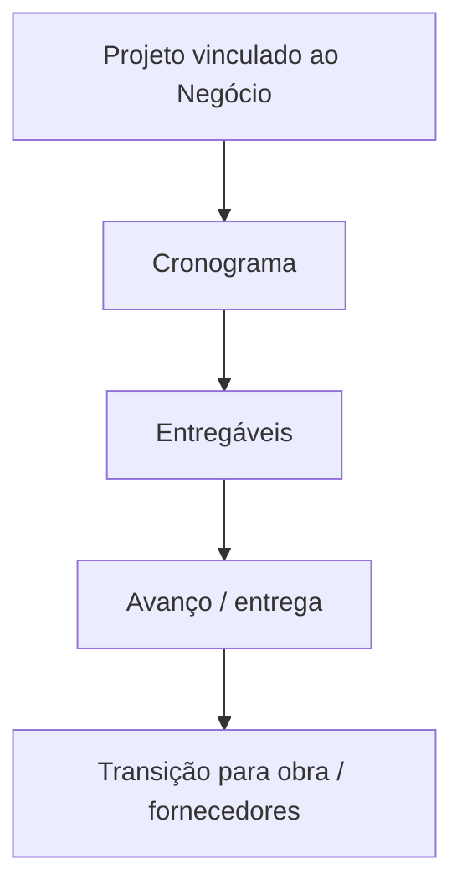

### 4.7 Obra / execução

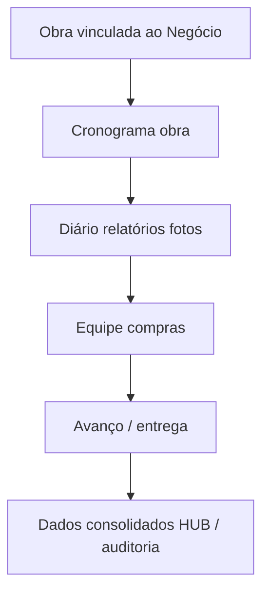

### 4.8 Fornecedor

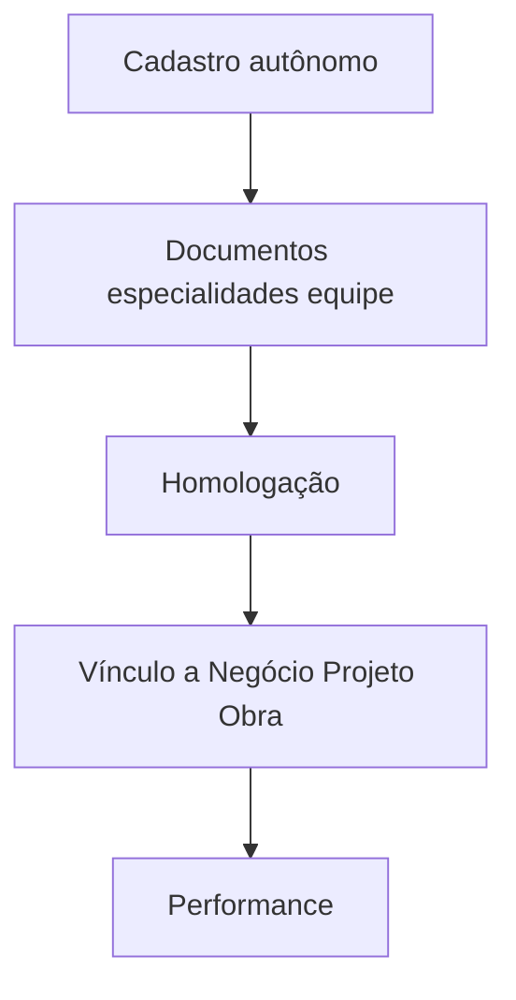

### 4.9 Produto e Serviço (catálogo + instância comercial)

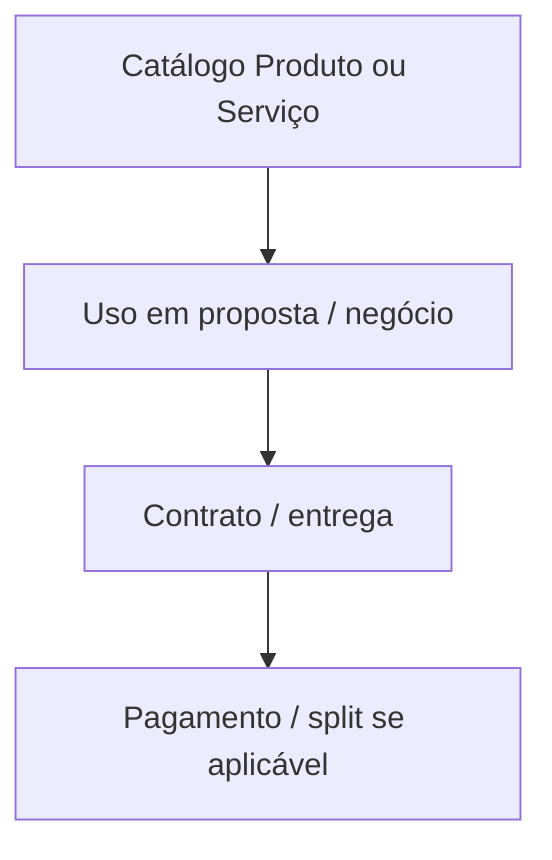

### 4.10 Contrato

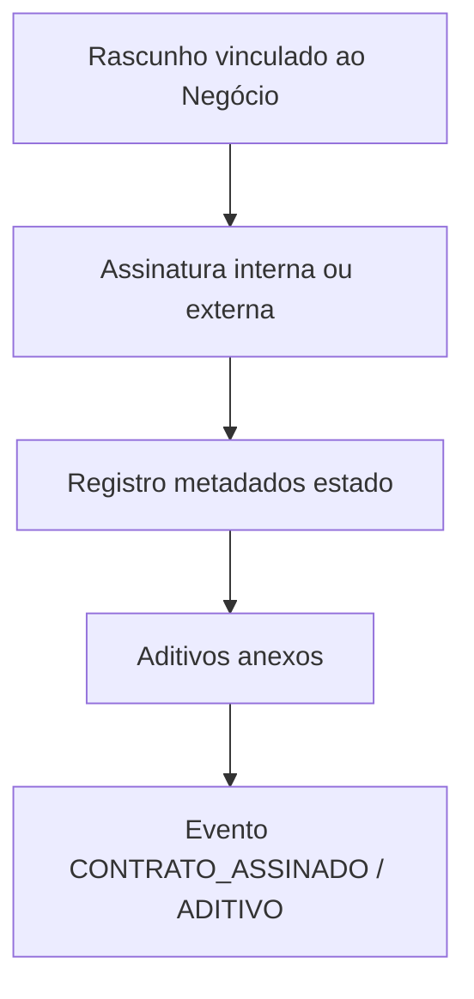

### 4.11 Avanço / entrega

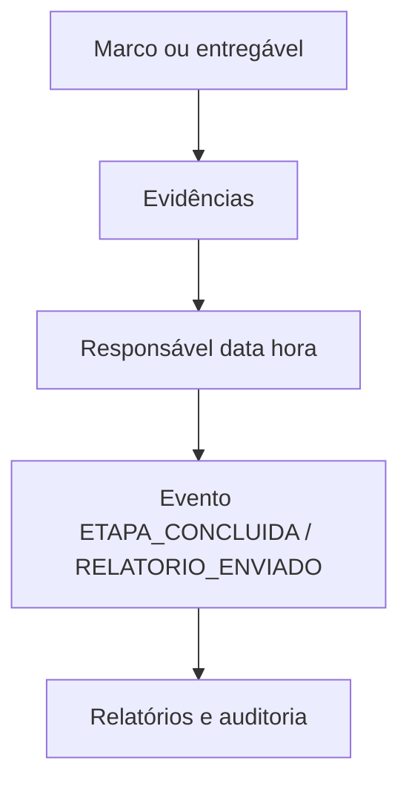

### 4.12 Pagamento

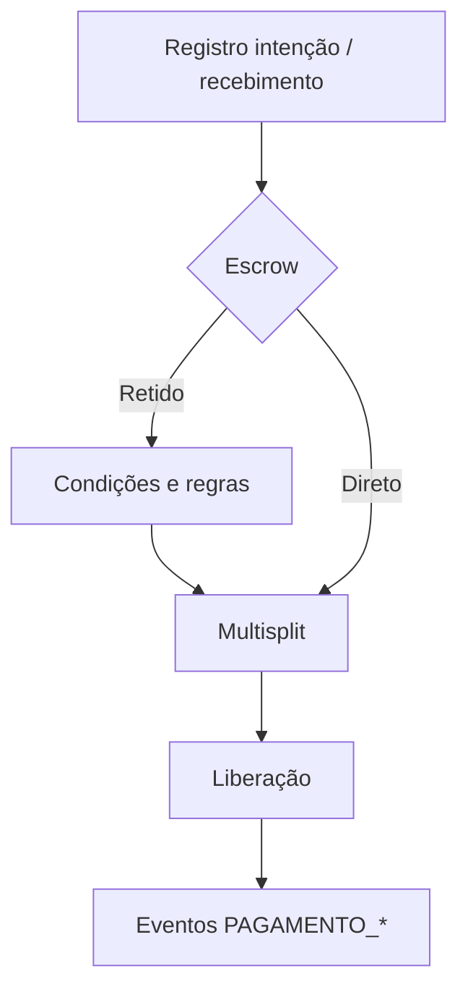

### 4.13 Pós-venda

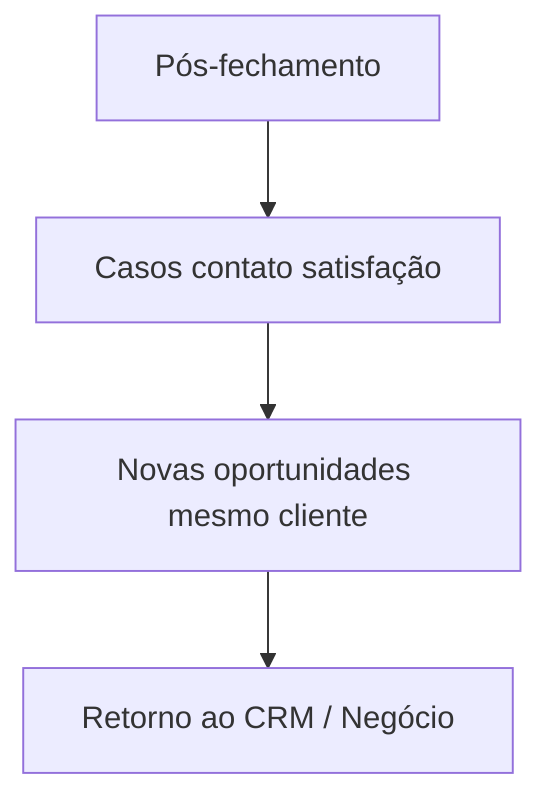

---

## 5. Mapa rápido: entidade → principais vínculos

| Entidade | Vínculos típicos |
|----------|------------------|
| **Pessoa** | Negócio, Empresa, usuário Auth, portal cliente |
| **Empresa** | Organização, Negócio, tipo imobiliária/arquitetura/fornecedor |
| **Negócio** | Todos os demais (eixo); `organizacao_id` |
| **Pipeline** | Negócio, estágios, histórico, eventos de movimentação |
| **Imóvel** | Negócio, interessados, imobiliária/corretor |
| **Projeto** | Negócio, entregáveis, avanços, fornecedores |
| **Obra** | Negócio, diário, fotos, equipe, compras |
| **Fornecedor** | Negócio, projeto, obra, homologação |
| **Produto** | Negócio, contrato, pagamento |
| **Serviço** | Negócio, obra, fornecedor, contrato |
| **Contrato** | Negócio, aditivos, Storage, assinatura externa |
| **Avanço/entrega** | Projeto, obra, relatório, evidências |
| **Pagamento** | Negócio, escrow, split, regras |
| **Pós-venda** | Negócio, pessoa, CRM contínuo |

---

## Documentos relacionados

| Documento | Uso |
|-----------|-----|
| [FLUXOGRAMA_FEATURES.md](./FLUXOGRAMA_FEATURES.md) | Funcionalidades e fluxos por módulo |
| [SPEC.md](./SPEC.md) | Definição canônica de entidades e regras |
| [SCHEMA_DADOS_V0.md](./SCHEMA_DADOS_V0.md) | Tabelas e colunas iniciais |

---

*Evoluir este arquivo quando novas entidades (ex.: proposta formalizada, proposta_comercial) forem introduzidas no schema.*
