# Fluxogramas — funcionalidades Obra10+ HUB

Inventário de **todas as funções** descritas no [SPEC.md](./SPEC.md), [MODULOS_PERMISSOES_E_HUB.md](./MODULOS_PERMISSOES_E_HUB.md), [PLANEJAMENTO.md](./PLANEJAMENTO.md), [GUIA_CAPTACAO_WHATSAPP_UAZAPI.md](./GUIA_CAPTACAO_WHATSAPP_UAZAPI.md) e [UI_LOGIN_E_IDENTIDADE.md](./UI_LOGIN_E_IDENTIDADE.md), com fluxogramas em Mermaid.

**Legenda do inventário (§1):** use como checklist de produto/QA; o SPEC prevê fases — nem tudo é Fase 1.

---

## 1. Inventário completo de funcionalidades (por módulo / camada)

### 1.1 Plataforma, identidade e governança

| # | Função |
|---|--------|
| G1 | Login / logout / sessão (Supabase Auth) |
| G2 | Usuário pertence a uma ou mais **organizações** (multi-tenant) |
| G3 | **Papéis** por organização (admin org, corretor, arquiteto, etc.) |
| G4 | **Administrador HUB:** gestão de organizações, módulos por org, templates de papel, auditoria cross-org, integrações globais, políticas financeiras de plataforma |
| G5 | **RLS** em dados sensíveis e multi-tenant — regras críticas não só no React |
| G6 | **Edge Functions** para webhooks (ads, WhatsApp), segredos PSP, jobs |
| G7 | **Supabase Storage** para anexos/contratos/evidências com policies |
| G8 | **Realtime** (opcional) quando fizer sentido |
| G9 | UI: **shell pós-login**, rotas por capacidade ([UI_LOGIN_E_IDENTIDADE.md](./UI_LOGIN_E_IDENTIDADE.md)) |
| G10 | Trilha de auditoria para acesso privilegiado HUB (sem bypass invisível) |

### 1.2 Captação e integrações (`captacao`)

| # | Função |
|---|--------|
| C1 | Entrada **Meta Ads** (webhook / API conforme desenho) |
| C2 | Entrada **Google Ads** |
| C3 | Entrada **LinkedIn Ads** |
| C4 | **Formulários** e **landing pages** → oportunidade/lead |
| C5 | **Cadastro manual** de lead/oportunidade |
| C6 | **Importações** futuras (planejadas no PRD) |
| C7 | Campos **origem, campanha, canal, segmento** (UTM / metadados) |
| C8 | **Desempenho por fonte** (base para relatórios) |
| C9 | **WhatsApp (uazapi):** webhook → Edge Function → Postgres; idempotência; paralelo a legado (Pipedrive) |
| C10 | Normalização e deduplicação onde aplicável |

### 1.3 CRM central multissegmentado (`crm_central`)

| # | Função |
|---|--------|
| R1 | Cadastro e gestão de **leads** |
| R2 | Cadastro e gestão de **oportunidades** |
| R3 | Entrada de **imóveis** como objeto comercial (também no imobiliário) |
| R4 | Cadastro de **serviços** e **produtos** no catálogo comercial |
| R5 | **Qualificação** de lead |
| R6 | **Pipeline** comercial com estágios |
| R7 | **Proposta** enviada / negociação |
| R8 | **Fechamento** (`NEGOCIO_FECHADO`) |
| R9 | CRM **continua após o fechamento** (ligação a contratos, obra, financeiro, pós-venda) |
| R10 | **Integração entre mercados** (imobiliário, arquitetura, serviços, produtos) no mesmo negócio |
| R11 | Conversão lead/oportunidade ↔ **Negócio** com `ID_NEGOCIO` |
| R12 | Histórico comercial e timeline alimentada por **eventos** |

### 1.4 Módulo imobiliário (`imobiliario`)

| # | Função |
|---|--------|
| I1 | **Imobiliárias parceiras** como **organizações** (onboarding/gestão pelo **Administrador HUB**); cadastro interno da equipe da parceira |
| I2 | Cadastro de **corretores** |
| I3 | Cadastro de **imóveis** |
| I4 | **Base / portal** de imóveis |
| I5 | **Relacionamento com interessados** |
| I6 | **Pipeline** de atendimento e venda |
| I7 | **Relatórios** imobiliários |
| I8 | Venda ou oportunidade qualificada **vinculada às demais camadas** via negócio |

### 1.5 Módulo arquitetura (`arquitetura`)

| # | Função |
|---|--------|
| A1 | **CRM do arquiteto** (funil próprio) |
| A2 | **Pipeline** de atendimento |
| A3 | Gestão de **oportunidades** e **clientes** |
| A4 | **Cronograma** de projeto |
| A5 | **Entregáveis** |
| A6 | Conexão com **fornecedores** e **executores** |
| A7 | Acompanhamento de **evolução** do projeto |
| A8 | **Transição** para execução (obra / serviços) |

### 1.6 Módulo engenharia e obra (`engenharia_obra`)

| # | Função |
|---|--------|
| O1 | **Cronograma** de obra |
| O2 | Acompanhamento de **avanço** |
| O3 | **Diário de obra** |
| O4 | **Relatórios** |
| O5 | **Fotos** / evidências |
| O6 | Gestão de **equipe** |
| O7 | **Contratos** e **aditivos** no âmbito da obra |
| O8 | **Compras** |
| O9 | **Controle de execução** |
| O10 | Executor **opera**; HUB **consolida, audita e lê** dados (sem microgerir tudo) |

### 1.7 Contratos e documentos (`contratos`)

| # | Função |
|---|--------|
| T1 | **Contrato** sempre vinculado ao **negócio** |
| T2 | **Aditivos** |
| T3 | **Anexos** e documentos complementares |
| T4 | Integração com **assinatura em plataforma externa** (metadados e estado) |
| T5 | Armazenamento seguro (Storage + RLS) |

### 1.8 Fornecedores e homologação (`fornecedores`)

| # | Função |
|---|--------|
| F0 | **MVP:** cadastro **induzido** pelo **arquiteto** e pela **organização** (admin/perfil autorizado); vínculo a **negócio** / projeto; fornecedor **pode não ter usuário** ainda |
| F1 | **Cadastro autônomo** do fornecedor (Fase 2+) |
| F2 | **Homologação** |
| F3 | **Estrutura da empresa** |
| F4 | **Equipe** |
| F5 | **Especialidades** |
| F6 | **Documentos** |
| F7 | **Performance** |
| F8 | Vínculo a **oportunidades**, **projetos** e **negócios** |
| F9 | Evento `FORNECEDOR_VINCULADO` |

### 1.9 Portal do cliente final (`cliente_portal`)

| # | Função |
|---|--------|
| P1 | Acompanhar **processo** e **status** |
| P2 | **Aprovar etapas** quando aplicável |
| P3 | Ver **cronogramas** |
| P4 | Ver **relatórios** e **fotos** |
| P5 | Ver **contratos**, **aditivos** e **pagamentos relevantes** |
| P6 | **UX simples** (sem expor complexidade interna) |

### 1.10 Módulo financeiro (`financeiro`)

| # | Função |
|---|--------|
| M1 | **Controle de pagamentos** |
| M2 | **Conta escrow** (lógica por negócio) |
| M3 | **Multisplit** |
| M4 | **Rastreabilidade** completa das movimentações |
| M5 | **Liberação condicionada a regras** e evidências |
| M6 | Dados estruturados para auditoria e analytics |
| M7 | Integração **PSP** via Edge (Fase posterior ao modelo de estados) |

### 1.11 Auditoria e governança (`auditoria`)

| # | Função |
|---|--------|
| U1 | **Ler** dados da operação |
| U2 | **Cruzar** dados |
| U3 | **Conformidade** |
| U4 | **Qualidade** |
| U5 | **Sustentar liberação financeira** com base em dados confiáveis |
| U6 | **Histórico** e trilhas |
| U7 | **Indicadores** |
| U8 | **Proteção** das partes envolvidas |
| U9 | **Não** substituir gestão operacional de cada área em cada etapa |

### 1.12 Relatórios e dados estruturados (`relatorios` + `dados_plataforma`)

| # | Função |
|---|--------|
| D1 | Leitura por **pessoa, empresa, negócio, segmento, origem, fornecedor, cadeia** |
| D2 | Indicadores: origem de lead, performance por mercado, volume por empresa, taxa de fechamento, avanço por etapa, volume financeiro, qualidade de entrega, incidência de aditivo, performance de fornecedor, comportamento por cadeia |
| D3 | **Dashboards** (CRM geral e por módulo) |
| D4 | Preparação para **exportação / BI / warehouse** (views, réplica) |

### 1.13 Onboarding e aprendizagem (`onboarding`)

| # | Função |
|---|--------|
| B1 | **Trilhas** de onboarding |
| B2 | **Módulos obrigatórios** |
| B3 | **Capacitação** |
| B4 | **Homologação digital** |
| B5 | **Progressão** por etapas |
| B6 | **Bloqueios** por não conclusão |

### 1.14 Operação orientada a eventos (transversal)

| # | Função |
|---|--------|
| E1 | Registro append-only **`domain_events`** |
| E2 | Cada evento: **data/hora**, **responsável**, **contexto** (`negocio_id`, payload) |
| E3 | Alimentar **histórico** e **relatórios** |
| E4 | Base para **automações** (Fase 3) |
| E5 | Catálogo de tipos (exemplos SPEC): `LEAD_CRIADO`, `IMOVEL_CADASTRADO`, `OPORTUNIDADE_CRIADA`, `MENSAGEM_RECEBIDA_WHATSAPP`, `LEAD_QUALIFICADO`, `PROPOSTA_ENVIADA`, `NEGOCIO_FECHADO`, `CONTRATO_ASSINADO`, `PROJETO_INICIADO`, `SERVICO_INICIADO`, `ETAPA_CONCLUIDA`, `RELATORIO_ENVIADO`, `PAGAMENTO_RECEBIDO`, `PAGAMENTO_LIBERADO`, `FORNECEDOR_VINCULADO`, `ADITIVO_APROVADO` |

### 1.15 Frontend e engenharia (PLANEJAMENTO)

| # | Função |
|---|--------|
| X1 | App **React** com estrutura por domínio ou feature folders |
| X2 | **TanStack Query** (ou similar) + Supabase — fonte única da verdade |
| X3 | Design system leve: formulários, tabelas, **pipeline** |
| X4 | Marcos M1–M12 conforme [PLANEJAMENTO.md](./PLANEJAMENTO.md) |

### 1.16 Fase 3 (PRD / PLANEJAMENTO — fora do MVP imediato)

| # | Função |
|---|--------|
| Z1 | **Automações** avançadas |
| Z2 | **Recomendações / IA** |
| Z3 | **Inteligência** e analytics ampliado |
| Z4 | Expansão de módulos e conectores |

---

## 2. Fluxograma mestre — jornada do sistema (7 etapas)

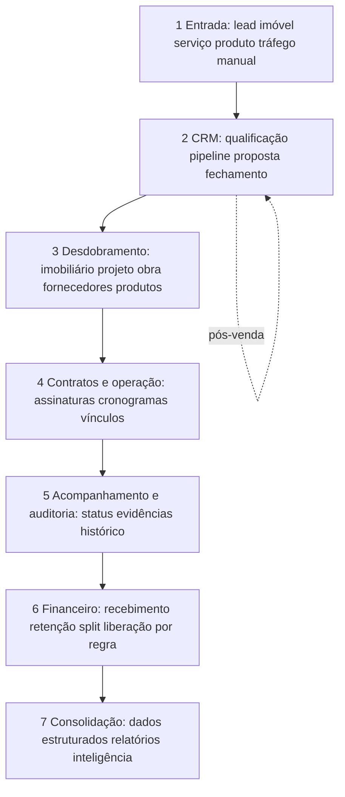

---

## 3. Captação → normalização → CRM

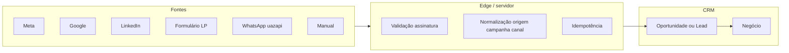

---

## 4. Pipeline comercial e eventos

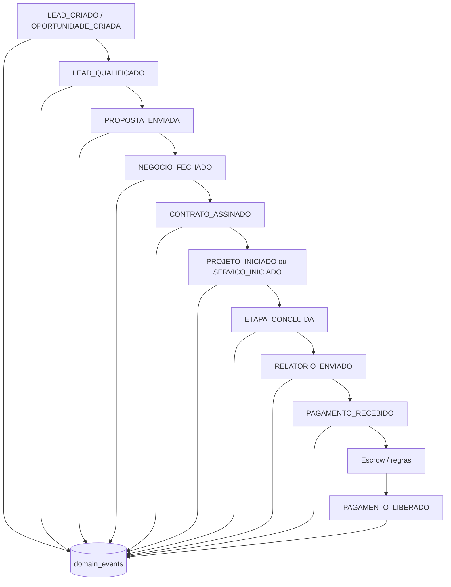

---

## 5. Módulo imobiliário (funções I1–I8)

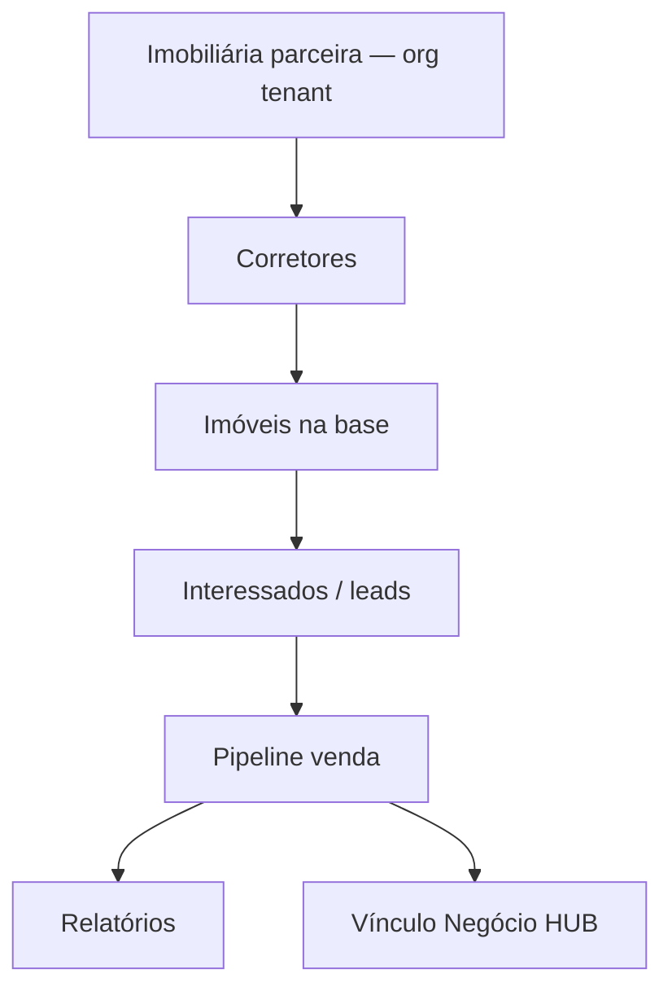

---

## 6. Arquitetura + transição para execução

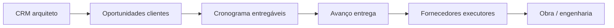

---

## 7. Engenharia / obra — operação vs HUB

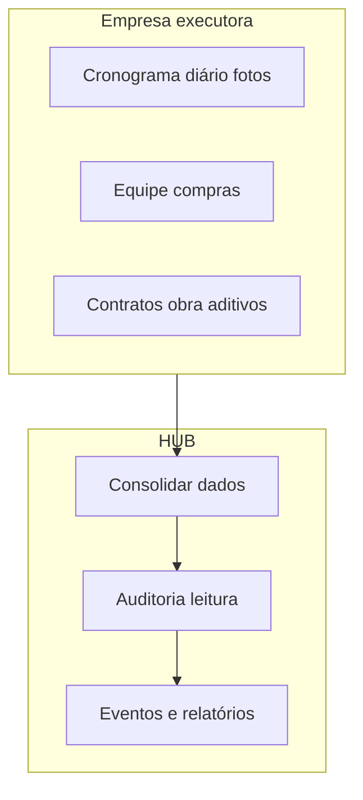

---

## 8. Contratos e assinatura externa

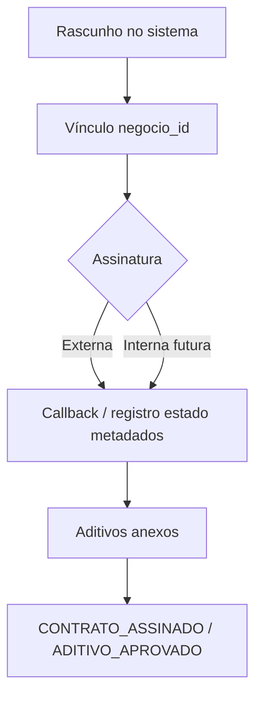

---

## 9. Financeiro — gate por regra (PRD)

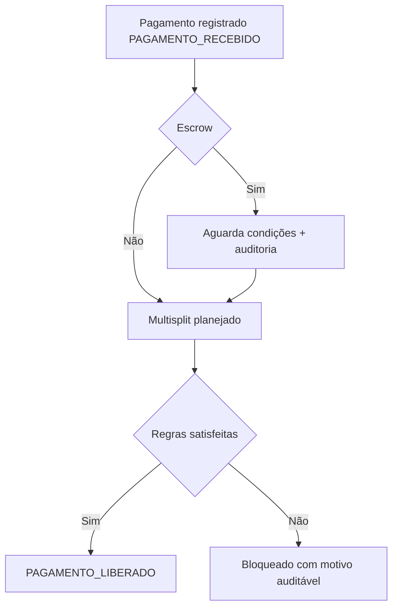

---

## 10. Fornecedor — MVP (induzido) vs rede autônoma

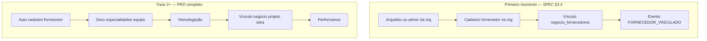

---

## 11. Portal do cliente

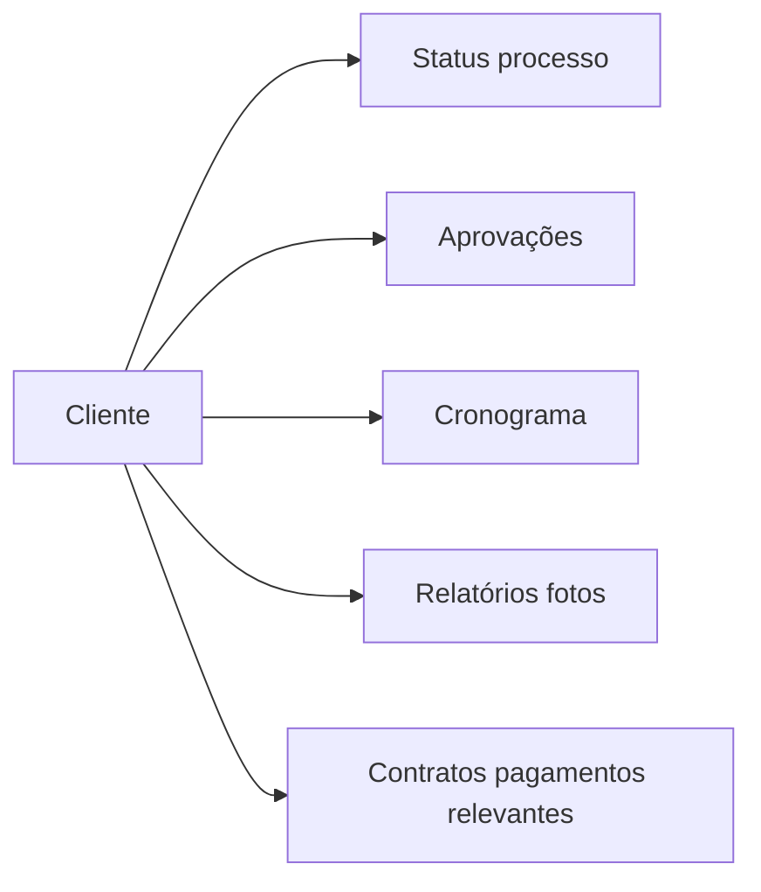

---

## 12. Auditoria + relatórios + dados

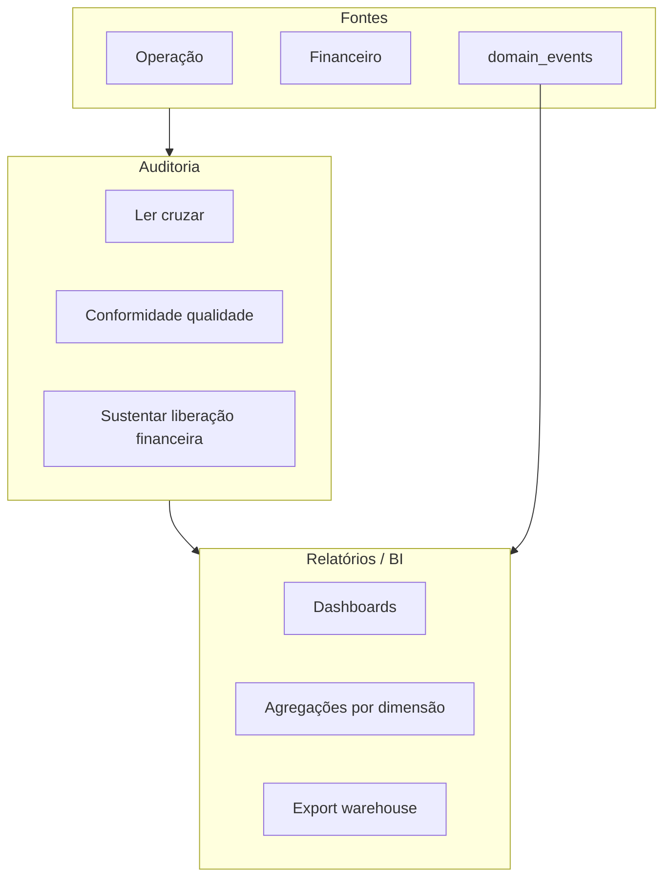

---

## 13. Onboarding (Fase 3)

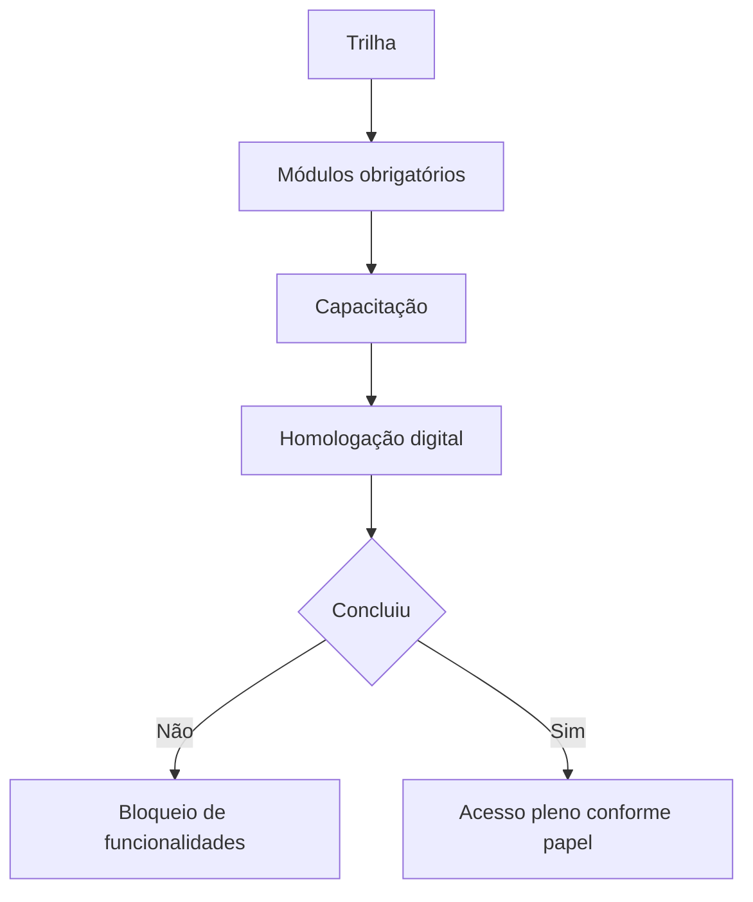

---

## 14. Governança: Administrador HUB vs admin da organização

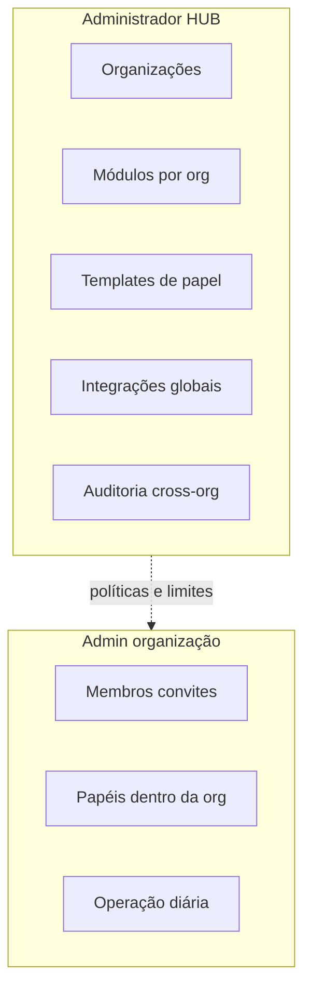

### Visibilidade: plataforma × organizações × RLS

Fluxo mental para **quem enxerga o quê**: usuários comuns ficam **dentro do tenant**; o **Administrador HUB** opera a plataforma e, para **governança**, pode cruzar organizações **com trilha** (ver [SPEC.md §4.1](./SPEC.md)).

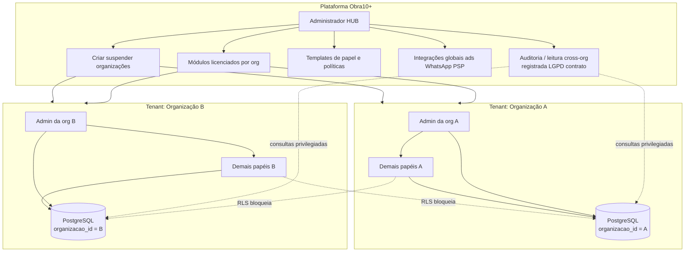

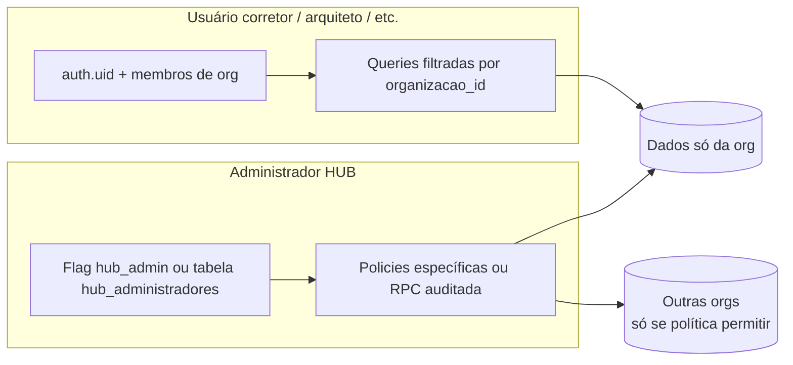

---

## 15. Evento de domínio — efeitos obrigatórios (PRD)

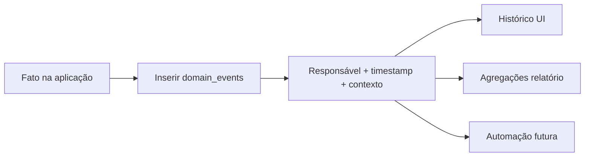

---

## Documentos relacionados

| Documento | Uso |
|-----------|-----|
| [FLUXOGRAMA_ENTIDADES.md](./FLUXOGRAMA_ENTIDADES.md) | Relações e ciclos de vida das entidades |
| [SPEC.md](./SPEC.md) | Fonte normativa de módulos e regras |
| [MODULOS_PERMISSOES_E_HUB.md](./MODULOS_PERMISSOES_E_HUB.md) | IDs de módulo e permissões |

---

*Ao incluir nova função no SPEC, atualizar a §1 e acrescentar subfluxo se necessário.*
