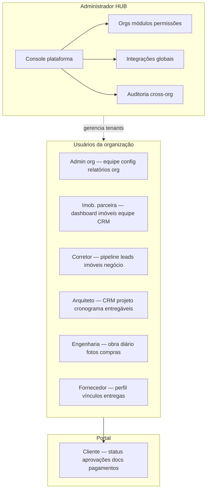
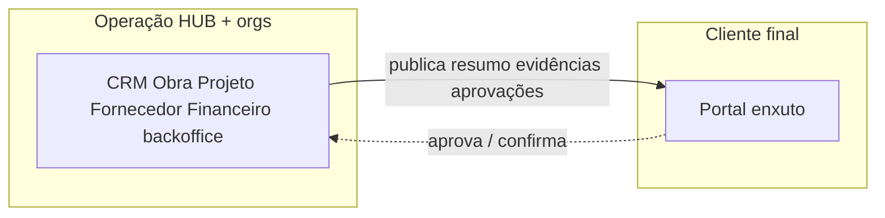

# Módulos e visualizações por perfil — Obra10+ HUB

Este documento detalha **quais módulos** cada participante costuma acessar e **que tipo de telas** (visualizações) a interface deve expor, alinhado ao [SPEC.md](./SPEC.md) (perfis, módulos, portal do cliente) e ao [MODULOS_PERMISSOES_E_HUB.md](./MODULOS_PERMISSOES_E_HUB.md).

**Princípios:** um único app **React**; rotas e menus vêm de **capacidades** (`useCan` ou equivalente); **RLS** garante que cada um só veja dados permitidos — a UI apenas **esconde** o que já está bloqueado no servidor.

**Imobiliária na coluna da matriz** = **imobiliária parceira**: empresa de intermediação que opera como **organização** (tenant) na plataforma, **cadastrada e governada pelo HUB** — não é o operador Obra10+ em si.

**Legenda de acesso (matriz):**

| Símbolo | Significado |
|---------|-------------|
| — | Sem acesso típico ao módulo |
| L | Leitura / acompanhamento |
| E | Criação e edição no escopo do papel |
| G | Governança (configuração, políticas, cross-org quando aplicável) |

---

## 1. Matriz rápida: módulo × perfil

Módulos conforme catálogo em [MODULOS_PERMISSOES_E_HUB.md §2](./MODULOS_PERMISSOES_E_HUB.md). Ajustável por **template HUB** e por **organização**.

| Módulo | Admin HUB | Admin org | Imob. parceira | Corretor | Arquiteto | Engenharia | Fornecedor | Cliente |
|--------|-----------|-----------|-------------|----------|-----------|------------|------------|---------|
| `captacao` | G | L | L | L | L | — | — | — |
| `crm_central` | G | E | E | E | E | L | L¹ | — |
| `imobiliario` | G | E | E | E | — | — | — | — |
| `arquitetura` | G | L | — | — | E | L² | L¹ | — |
| `engenharia_obra` | G | L | — | — | L² | E | L¹ | — |
| `contratos` | G | E | E | L/E | L | L | L¹ | L³ |
| `financeiro` | G | E | L/E | — | L | L | L¹ | L³ |
| `fornecedores` | G | L | — | — | L | L | E | — |
| `cliente_portal` | G | L | — | — | — | — | — | E⁴ |
| `auditoria` | G | L | — | — | — | — | — | — |
| `relatorios` | G | E | E | L | L | L | L | — |
| `onboarding` | G | E | E | E | E | E | E | — |
| `dados_plataforma` | G | L | — | — | — | — | — | — |

¹ Fornecedor: só **negócios/projetos/obras** onde está **vinculado** ou convidado.  
² Arquiteto ↔ obra: frequentemente **leitura** ou **comentários** na transição; engenharia **edita** execução.  
³ Cliente: **apenas** documentos e pagamentos **relevantes** ao seu negócio, UX reduzida.  
⁴ Cliente: no portal, “E” significa **interagir** (aprovar, confirmar leitura), não configurar sistema.

---

## 2. Visualizações por participante

### 2.1 Administrador HUB

| Área | Telas / visualizações |
|------|------------------------|
| Organizações | Lista global, cadastro edição, suspensão, detalhe da org |
| Módulos e licenças | Quais módulos cada org tem ativo |
| Permissões | Templates de papel (corretor, arquiteto…), exceções por org |
| Integrações | Ads, WhatsApp (uazapi), webhooks, chaves (via Edge) |
| Auditoria | Painel cross-org, trilhas, eventos sensíveis, exportações controladas |
| Financeiro plataforma | Políticas escrow/split de alto nível (não substituir operação de cada org sem regra) |
| Dados | Views agregadas, saída para BI |

**Não é foco:** operar pipeline comercial de um corretor no dia a dia (pode existir “modo suporte” futuro, fora do PRD mínimo).

---

### 2.2 Admin da organização

| Área | Telas / visualizações |
|------|------------------------|
| Equipe | Membros, convites, atribuição de **papel** na org |
| Identidade org | Dados da empresa, branding leve se houver |
| Módulos | Leitura do que o HUB habilitou; solicitação de módulo (futuro) |
| Relatórios | Dashboards **só da própria org** |
| Configuração | Integrações **da org** (quando não forem só globais) |
| Fornecedores (MVP) | **Cadastro induzido** de fornecedor na org e vínculo ao **negócio** (quem não for arquiteto costuma ser **admin** ou papel delegado) — ver [SPEC §3.3](./SPEC.md) |

---

### 2.3 Imobiliária parceira (gestor operacional na org)

Perfil típico do **gestor da organização** cuja empresa é uma **imobiliária parceira** do ecossistema HUB (tenant com módulo `imobiliario`). Corretores atuam **dentro** dessa mesma org.

| Área | Telas / visualizações |
|------|------------------------|
| Visão geral | Dashboard imobiliário: pipeline, metas, origem de leads |
| Equipe | Corretores, carteiras, permissões **dentro da imobiliária parceira** |
| Imóveis | Base/portal, cadastro, status, vínculo a negócios |
| CRM | Negócios da operação, qualificação, supervisão de propostas |
| Contratos | Visão dos contratos ligados aos negócios da org |
| Relatórios | Fechamento, conversão, performance por corretor/fonte |
| Fornecedores (MVP) | Mesmo padrão **induzido** pela org no **negócio** (se política permitir ao gestor imobiliário) |

---

### 2.4 Corretor

Em geral membro da **organização** de uma **imobiliária parceira** (ou equivalente comercial); escopo de dados limitado a essa org.

| Área | Telas / visualizações |
|------|------------------------|
| Funil | Pipeline **próprio** (ou da equipe, conforme política) |
| Leads / interessados | Lista, detalhe, histórico, tarefas |
| Imóveis | Consulta à base, fichas, compartilhamento com cliente |
| Negócio | Detalhe do `ID_NEGOCIO`, timeline de eventos comercial |
| Proposta | Registro de proposta enviada / versões (conforme produto) |
| Contratos | Leitura ou preenchimento assistido; **sem** liberação financeira |
| Captação | Origem do lead (leitura); formulários podem ser só back-office |

---

### 2.5 Arquiteto

| Área | Telas / visualizações |
|------|------------------------|
| CRM escritório | Oportunidades, clientes, pipeline de arquitetura |
| Projetos | Lista de projetos, detalhe, **cronograma**, **entregáveis** |
| Entregas | Marcos, upload de entregáveis, status |
| Negócio | Negócios ligados ao escritório; continuidade pós-fechamento — **porta de entrada** comum para o `ID_NEGOCIO` (ver [SPEC §3.2](./SPEC.md)) |
| Fornecedores (MVP) | **Cadastro induzido** + **vínculo** ao negócio/projeto (principal operador no primeiro momento, com [SPEC §3.3](./SPEC.md)) |
| Fornecedores / execução | Após MVP: leitura de rede homologada; handoff para obra |
| Obra | **Leitura** de avanço (fotos, relatórios) quando compartilhado — sem substituir engenharia |
| Contratos | Leitura dos contratos do negócio (escopo projeto) |

---

### 2.6 Engenharia / executora

| Área | Telas / visualizações |
|------|------------------------|
| Obras | Lista de obras, detalhe, vínculo ao `negocio_id` |
| Cronograma | Planejado vs realizado |
| Diário de obra | Registros diários, ocorrências |
| Evidências | Fotos, arquivos, relatórios de campo |
| Equipe | Alocação, presença (conforme necessidade) |
| Compras | Pedidos vinculados à obra (conforme módulo) |
| Contratos obra | Contratos e **aditivos** no âmbito da execução |
| Financeiro | **Leitura** de parcelas / status (liberação só se papel e regra permitirem) |

---

### 2.7 Fornecedor (marcenaria, marmoraria, vidraçaria…)

No **MVP**, o fornecedor pode existir só como **registro** criado pelo arquiteto ou pela org **sem login**. As telas abaixo refletem sobretudo a **Fase 2+** (autônomo + homologação).

| Área | Telas / visualizações |
|------|------------------------|
| Perfil empresa | Dados cadastrais, **documentos**, **especialidades**, equipe |
| Homologação | Status, pendências, reenvio de docs (Fase 2) |
| Oportunidades | Convites ou negócios **onde está vinculado** |
| Execução | Tarefas, entregas, prazos acordados |
| Performance | Indicadores atribuídos pelo HUB/org (Fase 2) |
| Onboarding | Trilhas obrigatórias (Fase 3) |

---

### 2.8 Cliente final (portal)

| Área | Telas / visualizações |
|------|------------------------|
| Início | **Status** do processo em linguagem simples (“onde estamos”) |
| Cronograma | Linha do tempo amigável (sem excesso técnico) |
| Aprovações | Filas do tipo “aprovar etapa” quando aplicável |
| Documentos | Contratos e aditivos **relevantes** (download/visualização) |
| Pagamentos | **Resumo** do que importa para o cliente (valores/vencimentos conforme política de privacidade) |
| Mídia | Relatórios e **fotos** selecionadas para o cliente |

**Ocultar:** pipeline interno, nomes internos de estágio cru, dados de outras empresas, telas administrativas.

---

### 2.9 Papel futuro opcional: auditor (somente leitura)

| Área | Telas |
|------|--------|
| Auditoria | Cruzamento de dados, conformidade, indicadores |
| Relatórios | Exportações auditáveis |

Sem editar organizações nem liberar pagamento, **salvo** produto definir workflow explícito.

---

## 3. Fluxograma — perfis e módulos (visão geral)

---

## 4. Fluxograma — cliente vs operação (simplificado)

---

## 5. Implementação na UI ([UI_LOGIN_E_IDENTIDADE.md](./UI_LOGIN_E_IDENTIDADE.md))

- **Pós-login:** shell com **navegação filtrada** por capacidades.
- **Mesma base de código:** componentes compartilhados (ex.: timeline de negócio) com **props** ou guards que limitam campos (cliente vê subset).
- **Rotas:** `/app/...` para equipes; `/portal/...` ou subdomínio para cliente, se desejarem separação visual forte.

---

## Documentos relacionados

| Documento | Conteúdo |
|-----------|----------|
| [SPEC.md §4–5](./SPEC.md) | Perfis e módulos normativos |
| [MODULOS_PERMISSOES_E_HUB.md](./MODULOS_PERMISSOES_E_HUB.md) | IDs de módulo, HUB vs org |
| [FLUXOGRAMA_FEATURES.md](./FLUXOGRAMA_FEATURES.md) | Inventário de funcionalidades |

---

*Ajustar células da matriz quando `organizacao_modulos` ou contratos comerciais restringirem módulos por tenant.*
